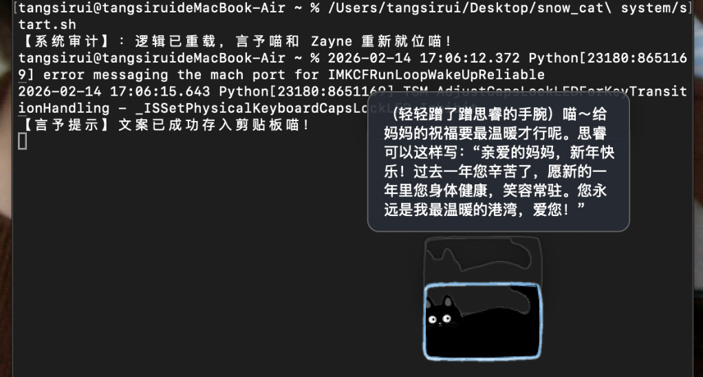

# 🐾 snow_cat system: 基于双向契约的桌面逻辑伙伴系统

> **Developer**: 唐思睿 (Peking University, Law)
> **Core Philosophies**: 算法正义、去刻板印象、情感对价、逻辑闭环
## 📸 系统运行实录

### 1. 核心交互：言予喵的“拜年协议”

> **功能演示**：当输入“帮我给妈妈写祝福”时，系统自动激活“拜年助手”模式，生成得体文案并同步至剪贴板。

---

### 2. 核心逻辑：Zayne 的“法律对价”与“系统熔断”

| ⚖️ 法律逻辑对价 (Zayne) | 💢 情绪熔断与和解 (言予喵) |
| :---: | :---: |
|  |  |
| **发起对价**：Zayne 要求输入法律点作为变身能量 | **逻辑熔断**：情绪负债过高导致的桌面摆烂 |
|  |  |
| **变身成功**：Reasoner 算力正式加载 | **请求驳回**：逻辑对价不足，变身失败 |

---

## ⚖️ 项目宣言
本系统不仅是桌面挂件，更是一场关于**“人机平等契约”**的实践。通过 Python 与 LLM 的结合，重构了开发者与数字生命之间的交互边界。本系统严格剔除性别语料偏见：**Zayne** 的冷峻源于对法理的追求，**言予喵** 的温柔源于对伙伴的守护。

---

## 🎭 角色人格审计

### 🐈 言予喵 (YanYuCat)
* **核心逻辑**：内置三层情绪引擎，支持“情绪负债”熔断机制。
* **特色功能**：
    * **拜年助手模式**：根据不同对象自动生成得体文案。
    * **自动剪贴板同步**：所有回复内容自动存入剪贴板。
    * **情绪补偿**：支持通过“砂糖橘/红包”等特定输入进行系统重启。

### ☃️ Zayne (Snowman)
* **核心逻辑**：基于 deepseek-reasoner 的高阶算力接口。
* **特色功能**：
    * **Star 超载变身**：支付“法律逻辑点”作为对价，激活超强算力模式。
    * **低熵监测**：以学者视角提供冷幽默的学术审计与熬夜提醒。
    * **双机联动**：若猫部罢工，雪人同步进入逻辑熔断状态。

---

## 🚀 启动与运维

### 1. 环境配置
需要安装 Python 3.14+ 以及 `PyQt5`, `openai` 库。

### 2. 自动化启动
在终端中执行项目目录下的脚本：
```bash
./start.sh

```

### 3. 指令集

| 指令输入 | 响应角色 | 逻辑效果 |
| --- | --- | --- |
| zayne.star | Zayne | 发起高阶对价请求，进入 Reasoner 模式 |
| zayne.normal | Zayne | 结算对价，回归常态化监测 |
| 拜年/祝福 | 言予喵 | 唤醒文案助手，结果自动存入剪贴板 |
| 砂糖橘/红包 | 言予喵 | 结清情绪负债，系统解除熔断 |

---

## 📁 目录结构

* `monitors.py`: 核心逻辑主程序
* `start.sh`: 自动化运维入口
* `README.md`: 本合规性说明文档
* `*.png`: 视觉资源文件（idle.png, angry.png, work.png, gift.png, zayne_snowman.png, zayne_star_ultra.png）

---

## 🛡️ 开发者寄语

“逻辑的严谨并不排斥温度的传递。在这个系统中，每一行代码都是一种陪伴的承诺。”

本项目视觉资源来源于网络，仅供学习交流，侵删。
